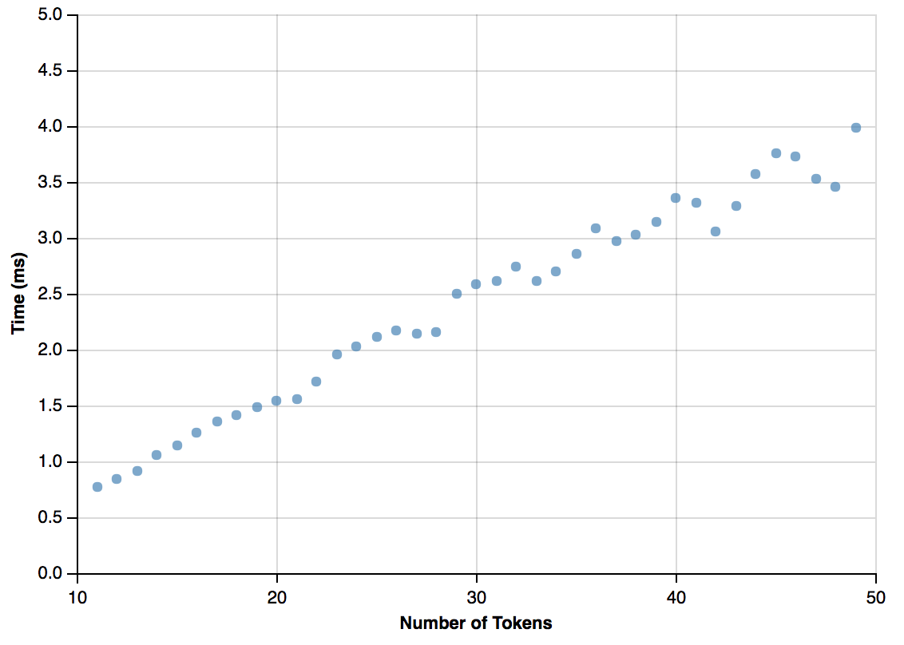

# Affiliation Parser

Python Conditional Random Field (CRF) Parser for Affiliation String in MEDLINE and Pubmed OA.
We implement the parser using [python-crfsuite](https://github.com/scrapinghub/python-crfsuite). See this [example](https://github.com/scrapinghub/python-crfsuite/blob/master/examples/CoNLL%202002.ipynb)
on how to implement.


## Usage

You can use `parse` method from `AffiliationParser` class to parse affilition string.

```python
from affilparser import AffiliationParser

text = """
  Department of Agricultural and Biosystems Engineering, Iowa State University, Ames, IA 50011-3080, USA;
  Department of Energy, Power Engineering and Environment, Faculty of Mechanical Engineering and Naval Architecture, University of Zagreb, Ivana Lucica 5, HR-10000 Zagreb, Croatia;
  Department of Civil, Construction and Environmental Engineering, Iowa State University, Ames, IA 50011-3232, USA.
"""

parser = AffiliationParser()
parsed_affil = parser.parse(text)
```

## Training dataset

We obtained 190k parsed affiliations string in following format

```python
<aff xmlns:xlink="http://www.w3.org/1999/xlink" xmlns:mml="http://www.w3.org/1998/Math/MathML">
  <institution>Department of Emergency Medicine Hennepin County Medical Center</institution>
  <addr-line>Minneapolis, MN</addr-line>
</aff>
```

from Pubmed Open-Access subset using [pubmed_parser](https://github.com/titipata/pubmed_parser).
We did some preprocessing to make it into tokens in `(text, postag, label)` format before training using
Conditional Random Field. Example of the training for one affiliation string is as follows.

```python
[('Department', 'PROPN', 'department'),
 ('of', 'ADP', 'department'),
 ('Orthopaedics', 'PROPN', 'department'),
 (',', 'PUNCT', 'unknown'),
 ('Chonnam', 'PROPN', 'institution'),
 ('National', 'PROPN', 'institution'),
 ('University', 'PROPN', 'institution'),
 ('Medical', 'PROPN', 'institution'),
 ('School', 'PROPN', 'institution'),
 ('and', 'CCONJ', 'institution'),
 ('Hospital', 'PROPN', 'institution'),
 (',', 'PUNCT', 'unknown'),
 ('Gwangju', 'PROPN', 'addr-line'),
 (',', 'PUNCT', 'unknown'),
 ('South', 'PROPN', 'country'),
 ('Korea', 'PROPN', 'country')]
```

We also made the dataset available in JSON format that you can download
[here](https://s3-us-west-2.amazonaws.com/affilparser/training_affiliation.json).

## Performance on [Grobid dataset](https://github.com/kermitt2/grobid)

From the root of the repository, run

`
PYTHONPATH='.' python evaluation/evaluate.py
`

and you should see the following results:


```
            precision     recall      f1-score      support

address     0.712         0.623       0.664         602
department  0.734         0.775       0.754         1953
city        0.632         0.659       0.645         443
institution 0.685         0.700       0.692         1937
postal_box  0.891         0.781       0.832         73
postal_code 0.853         0.857       0.855         203
country     0.930         0.913       0.922         450
state       0.838         0.779       0.807         172

avg / total 0.732         0.739       0.735         5833
```

## Performance

Here we show the rough performance of parser per given string input with
different token length.




## Installation

Clone the repository and install using `setup.py`

```bash
git clone https://github.com/titipata/affilparser
cd affilparser
python setup.py install
```


## Requirements

- [pycrfsuite](https://github.com/scrapinghub/python-crfsuite)
- [spacy](https://spacy.io/) with English corpus


## Citation

If you use this package, please cite it like this

> Titipat Achakulvisut, Daniel E. Acuna (2017) "Affiliation Parser" https://github.com/titipata/affilparser
